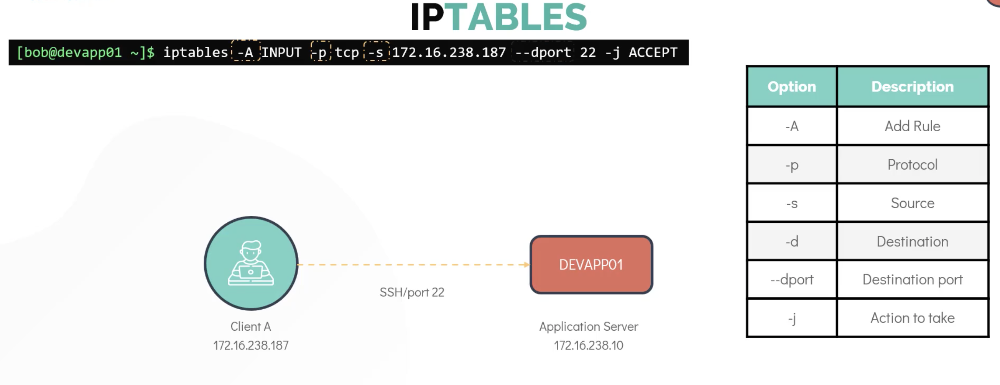

#IPTABLES
  - Install iptables 
    ```
      sudo apt install iptables
    ```
    
  - Check rules
    ```
      sudo iptables -L
    ```
    
  

  - Drop rule
    ```
      sudo iptables -D INPUT/OUTPUT 1
    ```
