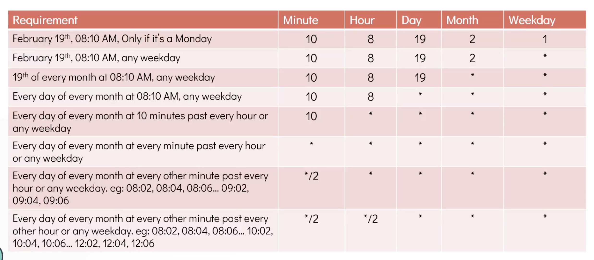

#CRONJOBS

  - list all the cronjobs created for a user
    ```
      crontab -l
    ```

  - check active jobs for root user
    ```
      sudo crontab -l
    ```

  - create job
    ```
      crontab -e
    ```
    
  

  - check job completion
    ```
      cat tmp/system-report.txt
    ```


